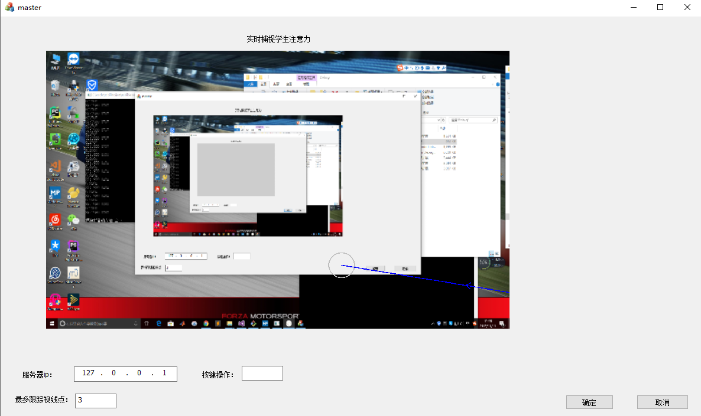

## tobii眼动客户端程序 ##

> 最近两天一直在做关于tobii的应用，这是客户端端代码，主要利用MFC框架展示从服务器端接受到的图片和视线点

### 实现功能 ###
 1.	实时展示服务端发送过来的图片和视线点，可以进行ip设置和视线点设置
 

### 使用说明 ###
 1.	安装库：ZeroMQ 和 zguide库，实现数据传送  
 3.	opencv  
 3.	用cmake进行编译,CMakeLists.txt中的库链接需要改成你本机的路径

 ### 效果展示 ###  
 
